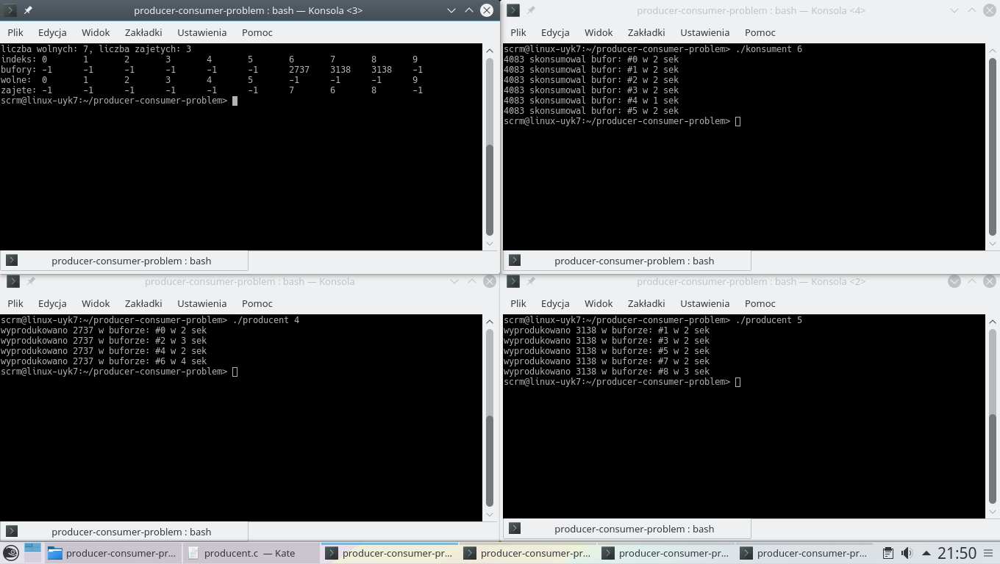

# Producer-consumer problem
University project for "Concurrent Programming". Classic multi-process synchronization problem implementation written in C using POSIX Thread, semaphore and shm libraries.

## Prerequisites

* Linux OS (with POSIX Thread, semaphore and sys/shm libraries)

## Compiling

```
gcc -Wall -pthread sterowanie.c -o sterowanie
gcc -Wall -pthread producent.c -o producent
gcc -Wall -pthread konsument.c -o konsument
```

## Running

Run each process in different terminal.
- Controller
  - Type `./sterowanie [number of buffers]` in command line (e.g ./sterowanie 10) 
- Producer
  - Type `./producent [number of produced elements]` in command line (e.g ./producent 8) 
- Consumer
  - Type `./konsument [number of consumed elements]` in command line (e.g ./konsument 6) 

## Screenshots


